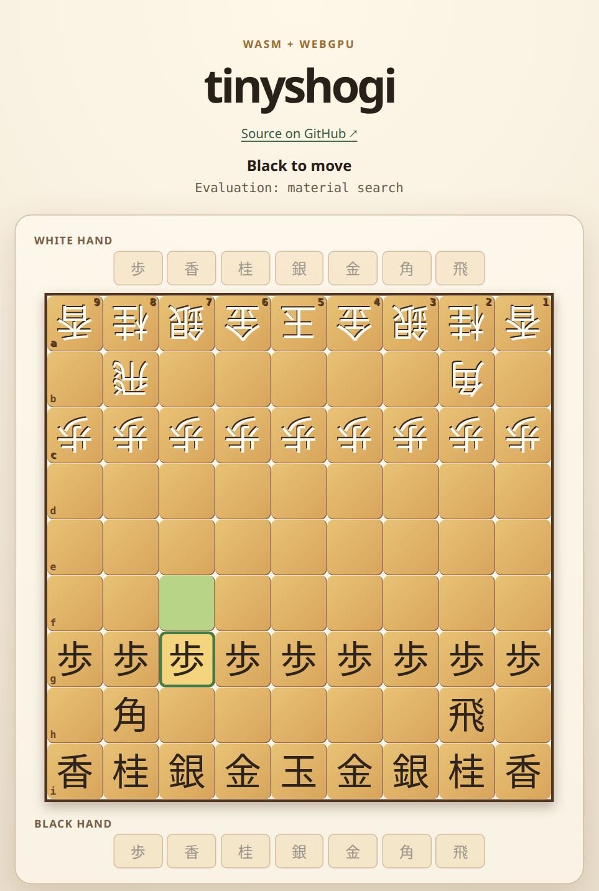
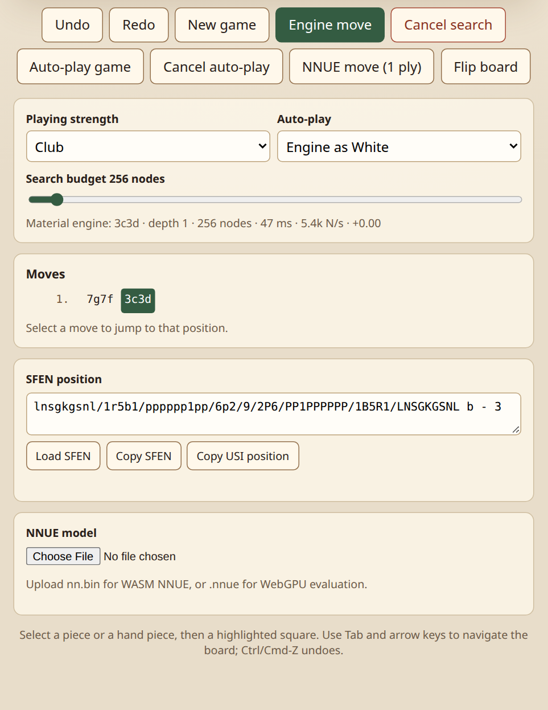

# tinyshogi

A standard 9×9 shogi engine written in C11, with a USI interface, MCTS and
alpha-beta search, optional NNUE evaluation, and a browser demo.

## Live browser demo

[Play tinyshogi on GitHub Pages](https://lighttransport.github.io/tinyshogi/)
— no installation required. Play against the WASM engine, review the move
history, or import a position using SFEN. NNUE models are optional and loaded
from your own files.

<p>
  
  
</p>

The board highlights legal moves; the controls provide strength presets,
auto-play, undo/redo, position sharing, and local model loading.

## Quick start

Requires a C11 compiler, Make, and a POSIX environment.

```sh
make
make check
./build/make/tinyshogi
```

The executable accepts [USI commands](doc/guide.md#usi-commands).
[Other build options](doc/guide.md#build) cover Meson, CMake, xmake, and local
browser development.

## Documentation

- [User guide](doc/guide.md): builds, USI options, self-play, evaluator plugins,
  training, benchmarks, fuzzing, and MCP automation.
- [Technical overview](doc/tinyshogi.md): engine architecture, search, NNUE, and
  A64FX optimization.
- [Strength experiments](doc/strength.md): match results, limitations, and reproduction.
- [Training report](doc/train.md): distributed training and optimizer comparisons.
- GPU workflows: [CUDA](cuda/README.md) and [CUDA/ROCm NNUE training](gpu/README.md).

## License

[Apache License 2.0](LICENSE). Optional external engines, validators, and model
weights have their own licenses; see [provenance](doc/guide.md#license-and-provenance).
